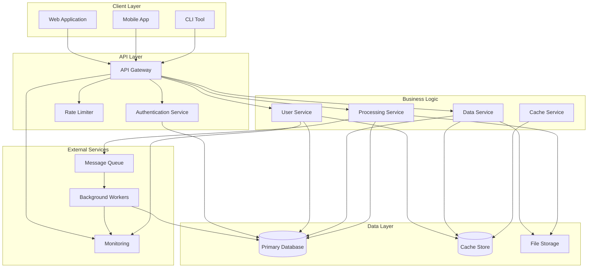

# Architecture Overview

This document provides a visual overview of the system architecture.

## System Architecture

## Components

### Client Layer
- **Web Application**: Browser-based client interface
- **Mobile App**: Native or cross-platform mobile application
- **CLI Tool**: Command-line interface for automation

### API Layer
- **API Gateway**: Central entry point for all requests
- **Authentication Service**: Handles user authentication and authorization
- **Rate Limiter**: Prevents abuse through request throttling

### Business Logic
- **User Service**: Manages user accounts and profiles
- **Data Service**: Handles data operations and retrieval
- **Processing Service**: Core business logic and processing
- **Cache Service**: Manages caching layer

### Data Layer
- **Primary Database**: Main persistent data storage
- **Cache Store**: Redis or similar for fast data access
- **File Storage**: Cloud or local storage for files

### External Services
- **Message Queue**: Asynchronous task queue
- **Background Workers**: Process long-running tasks
- **Monitoring**: Observability and alerting

## Data Flow

1. Client requests reach the **API Gateway**
2. **Authentication Service** validates credentials
3. **Rate Limiter** checks usage limits
4. Request routed to appropriate **Business Logic Service**
5. Service queries **Cache** first, then **Database** if needed
6. For async operations, tasks queued to **Message Queue**
7. **Background Workers** process queued tasks
8. **Monitoring** tracks all operations for observability
